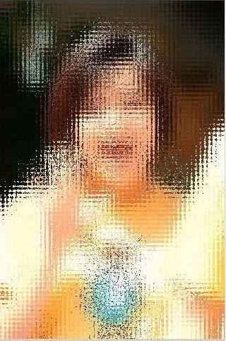



## Looking through translucent glass

### Description

Translucent effect of looking through a glass using GetDIBits and SetDIBits API. Based on tutorial on some website (I forgot the address).

Comments and suggestions are welcome!
 
### More Info
 

             |
---                |---
**Submitted On**   |2003-05-16 17:22:02
**By**             |[Min Thant Sin](https://github.com/Planet-Source-Code/PSCIndex/blob/master/ByAuthor/min-thant-sin.md)
**Level**          |Beginner
**User Rating**    |4.0 (8 globes from 2 users)
**Compatibility**  |VB 6\.0
**Category**       |[Graphics](https://github.com/Planet-Source-Code/PSCIndex/blob/master/ByCategory/graphics__1-46.md)
**World**          |[Visual Basic](https://github.com/Planet-Source-Code/PSCIndex/blob/master/ByWorld/visual-basic.md)
**Archive File**   |[Looking\_th1588755162003\.zip](https://github.com/Planet-Source-Code/min-thant-sin-looking-through-translucent-glass__1-45534/archive/master.zip)

